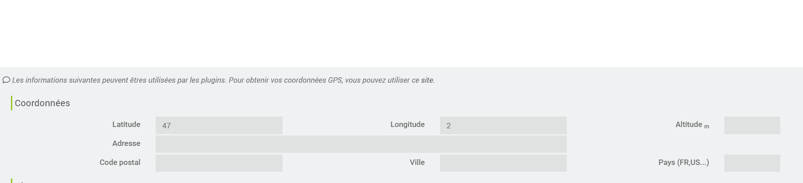

# Plugin Natural Light

Plugin permettant de gérer la notion de naturalLight pour **Jeedom**.

# Introduction 

La luminosité naturelle évolue en fonction de l'heure de la journée.
Elle est de couleur chaude au matin (jaune), puis devient de plus en plus froide (blanche) vers le milieu de la journée, puis décline en fin de journée pour redevenir une couleur chaude.
Pour respecter le cycle circadien et favoriser le sommeil, il est intéressant de moduler aussi l'éclairage de nos maisons pour coller au plus prêt à ce changement.
A noter : la lumière froide de nos lampes LED peut perturber le sommeil.

# Configuration du plugin

La configuration est simple.

## Emplacement

Le plugin s'adapte à l'emplacement de Jeedom.
Il faut donc vérifier que cela est correctement renseigné
Dans le menu Réglages/Système/Configuration, puis dans l'onglet Général, voir la section Coordonnées

## Onglet Equipement

Lors de la création de l'équipement, l'onglet Equipement est standard.
Renseigner le nom, l'objet parent et les options souhaités.
cocher "Activer".
Il n'est pas nécessaire de cocher "Visible", les informations affichées seront plus utiliser pour du debug (Sun Elevation, Temperature Color - voir la section Commandes)

## Onglet Lumières

Cet onglet permet de sélectionner la lampe qu'on souhaite gérer.
Il faut alors renseigner 2 informations :
- Température couleur : la commande de la lampe permettant de modifier la température couleur,
- Lampe état : la commandede la lampe  permettant de savoir si la lampe est allumer ou éteinte.

## Onglet Commandes

L'onglet Commandes permet de voir les commandes créées :
- Rafraichir : permet de forcer le calcul de la couleur à appliquer.
- Sun Elevation : Indique l'élévation du soleil.
- Temperature color : Température couleur à appliquer.

