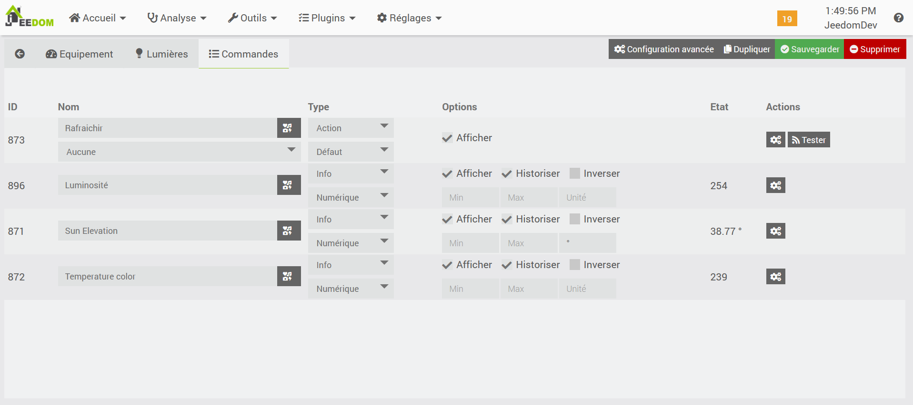

# Plugin Natural Light

Plugin permettant de gérer la notion de naturalLight pour **Jeedom**.

# Introduction 

La luminosité naturelle évolue en fonction de l'heure de la journée.
Elle est de couleur chaude au matin (jaune), puis devient de plus en plus froide (blanche) vers le milieu de la journée, puis décline en fin de journée pour redevenir une couleur chaude.
Pour respecter le cycle circadien et favoriser le sommeil, il est intéressant de moduler aussi l'éclairage de nos maisons pour coller au plus prêt à ce changement.
A noter : la lumière froide de nos lampes LED peut perturber le sommeil.

# Configuration du plugin

La configuration est simple.

## Emplacement

Le plugin s'adapte à l'emplacement de Jeedom.
Il faut donc vérifier que cela est correctement renseigné
Dans le menu Réglages/Système/Configuration, puis dans l'onglet Général, voir la section Coordonnées

## Onglet Equipement

Lors de la création de l'équipement, l'onglet Equipement est standard.
Renseigner le nom, l'objet parent et les options souhaités.
cocher "Activer".
Il n'est pas nécessaire de cocher "Visible", les informations affichées seront plus utiliser pour du debug (Sun Elevation, Temperature Color - voir la section Commandes)

## Onglet Lumières

Cet onglet permet de sélectionner la lampe qu'on souhaite gérer.

Le paramétrage s'effectue sur 3 zones :
- Lampe état : Renseigner la commande qui permet de connaitre l'état de la lampe
    La commande doit avoir le type générique "Lumière état" (LIGHT_STATE) 

- Température lampe :
Cette partie permet de gérer la modification de la température couleur de la lampe.
- Activer : Permet d'activer cette partie
- Température couleur : la commande de la lampe permettant de modifier la température couleur.
    La commande doit avoir le type générique "Lumière luminosité" (LIGHT_SET_COLOR_TEMP)
Note : Le choix de la commande de la lampe permet de récupérer les valeurs min et max par défaut de la commande lors de l'enregistrement
- Valeur min et max : valeur minimum et maximum, dans l'unité de la lampe et pas forcément en mired.
La valeur Température couleur sera alors modifiée automatiquement selon l'élévation du soleil, tout en respectant ces bornes.
- Condition de lancement : Condition pour que la gestion soit activée.
    Si non renseignée, alors la température est modifiée comme souhaitée.

- Luminosité lampe :
Cette partie permet de gérer la modification de la luminosité de la lampe.
- Activer : Permet d'activer cette partie
- Luminosité : Pla commande de la lampe permettant de modifier la luminosité.
    La commande doit avoir le type générique "Lumière slider" (LIGHT_SLIDER)
 Note : Le choix de la commande de la lampe permet de récupérer les valeurs min et max par défaut de la commande lors de l'enregistrement
 - Valeur min et max : valeur minimum et maximum, en général entre 0 et 254.
La valeur Luminosité sera alors modifiée automatiquement selon les horaires, tout en respectant ces bornes.
- Heure matin : Heure à partir de laquelle la luminosité va passer du minimum au maximum.
- Durée : Durée en minute pour gérer la transition de la luminosité
- Heure soir : Heure à partir de laquelle la luminosité va passer du maximum au minimum.
- Durée : Durée en minute pour gérer la transition de la luminosité
- Condition de lancement : Condition pour que la gestion soit activée.
    Si non renseignée, alors la luminosité est modifiée comme souhaitée.

## Onglet Commandes

L'onglet Commandes permet de voir les commandes créées :
- Rafraichir : permet de forcer le calcul de la couleur à appliquer.
- Luminosité : Indique la luminosité qui sera à appliquer.
- Sun Elevation : Indique l'élévation du soleil.
- Temperature color : Température couleur qui sera à appliquer.

